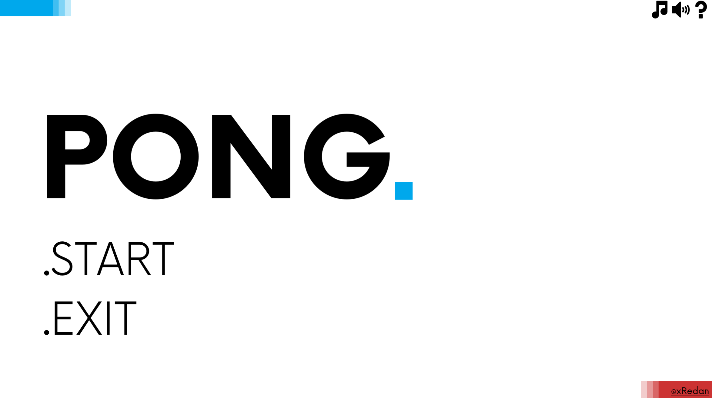
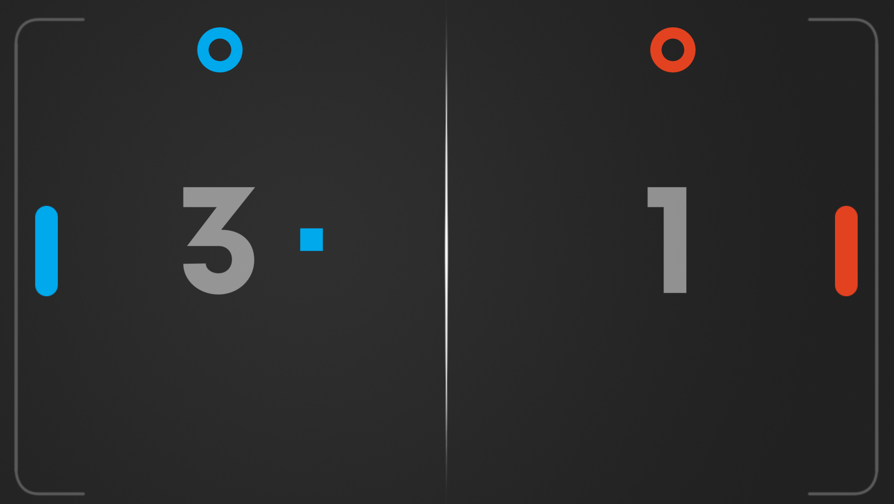

# Minimal Pong Remake





## How to Play
**You can play [>>HERE<<](https://xredan.itch.io/minimal-pong)**

Or

1. **Clone the repository:** ``` https://github.com/xRedan/Pong-Godot.git ```
2. **Open in Godot Engine:** Launch Godot Engine 4.4.1, then click on "Import" and select the `project.godot` file from the cloned repository.
3. **Run the Project.**

## About


A clone of the classic arcade game Pong, built with **Godot 4.4.1**.
The goal of this project is to learn how to use the Godot engine and its GDScript language.

This is the first game of [The 20 Games Challenge.](https://20_games_challenge.gitlab.io/challenge/)

This entire project, from code to design, was crafted solely by me. The only exception is the music, which was generated using [Riffusion](https://www.riffusion.com/).

## Features
- **Classic Pong Gameplay.**

- **Menus!**

- **Sound & Music.**

- **Dash Mechanic:** Introducing a "dash" ability for both players.

- **Enhanced Ball Physics:** The ball's speed dynamically increases based on the paddle's movement speed.

- **Multiple Game Modes:** Challenge yourself against an AI opponent in VS CPU mode or compete with a friend in Local Multiplayer.

